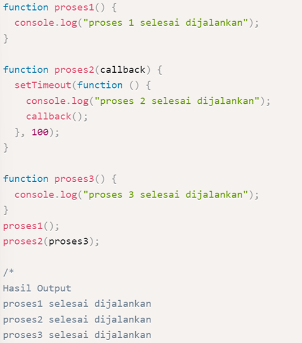
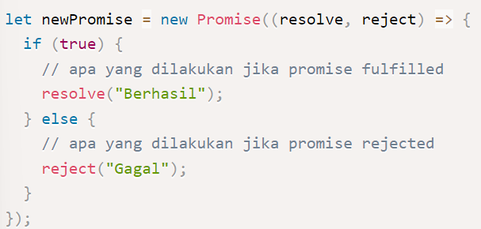

# Week 4
# Javascript Intermediate
## **Asyncronus**
- **Pengertian Asyncronus**
**Asynchronous** yang biasa dikenal juga dengan sebutan non-blocking mengizinkan komputer kita untuk memproses perintah lain sambil menunggu suatu proses lain yang sedang berlangsung. Eksekusi perintah dengan asynchronous tidak akan melakukan blocking atau menunggu perintah sebelumnya selesai. Jadi sambil menunggu kita bisa mengeksekusi perintah lain.

- **Cara menjalankan asyncronus pada javascript**

    Jika JavaScript secara default bersifat synchronous, Ada beberapa cara untuk membuat proses asynchronous, yaitu :

    1.	setTimeout(function, milliseconds) digunakan untuk simulasi pemanggilan kembali proses asynchronous yang sedang/sudah selesai dijalankan. Pemanggilan hanya dilakukan 1 kali.

    2.	setInterval(function, milliseconds) digunakan untuk simulasi pemanggilan proses asynchronous yang sedang/sudah dijalankan dalam interval waktu tertentu. Pemanggilan dilakukan berkali-kali sesuai interval waktu yang ditentukan.

    
- **Callback** <br>
**Callback** adalah sebuah function, namun bedanya dengan function pada umumnya adalah pada cara eksekusinya. Jika function pada umumnya dieksekusi secara langsung, sedangkan callback dieksekusi di dalam function lain melalui parameter. <br> <br>


<br>

- **Promise** <br>
**Promise** sendiri adalah salah satu fitur dari ES6 (ES2015) JavaScript. Konsep promise hadir untuk memecahkan masalah yang bertele-tele dengan callback.

    3 status promise di javascript :

    1.	pending, jika data sedang diproses.

    2.	fulfilled, jika data telah berhasil didapatkan.

    3.	rejected, jika data gagal didapatkan.

    Contoh : <br> <br>
    

<br> <br>

# Git & Github Lanjutan
- **GitHub Collaboration** <br>
Dengan menggunakan github kita dapat melakukan kolaborasi dengan tim kita, dimana terdapat sebuah fitur pada github yang berfungsi untuk mengundang tim atau orang lain agar dapat berkolaborasi dalam sebuah repository. Kolaborasi tersebut dapat dilakukan dengan cara mengundang orang lain untuk menjadi kontributor pada repository kita.

- **Pull Request** <br>
Pull request adalah sebuah kondisi dimana ketika kita menginformasikan user bahwa kita sudah memindahkan perubahan yang kita lakukan di branch ke master repositori. Collaborator repositori selanjutnya akan menerima atau menolak pull request tersebut.

    Berikut ini merupakan beberapa langkah untuk membuat pull request : <br>
        - Masuk ke repositori dan cari menu branch. <br>
        -  Di menu branch. pilih branch yang menyimpan commit kita. <br>
        - Klik opsi New pull request yang ada di samping menu branch. <br>
        - Masukan judul dan deskripsi pull request. <br>
        - Klik opsi Create pull.

- **Mengatasi Konflik** <br>
Konflik merupakan sebuah permasalahan yang terjadi ketika kita melakukan perubahan kode yang dilakukan oleh dua orang yang berbeda pada satu baris kode yang sama. Berikut ini merupakan cara mengatasi konflik di Github :

    - Buka repository github
    - Pilih tab pull request
    - Pilih pull request yang akan diterima
    - Klik tombol resolve conflicts
    - Atur perubahan kode yang dilakukan oleh orang tersebut.
    - Klik tombol mark as resolved
    - Klik tombol commit merge

<br>

- **Git Branch** <br>
**Branch** merupakan salinan dari sebuah repositori. Kita dapat menggunakan branch ketika akan melakukan suatu pengembangan atau development secara terpisah. Task yang kita kerjakan di branch tidak akan mempengaruhi repositori utama atau branch lainnya. Jadi jika pengembangannya sudah selesai, kita dapat menggabungkan branch saat ini ke branch lainnya dan juga terhadap repositori utama dengan menggunakan pull request.

    1. Membuat Branch <br> <br>

    ```
        git branch nama-branch
    ```

    2. Berpindah Branch <br> <br>

    ```
        git checkout nama-branch
    ```

    3. Menggabungkan Branch <br> <br>

    ```
        git merge nama-branch
    ```

<br> <br>

# Responsive Web Design
- **Apa itu responsive web design?** <br>
**Responsive web design** merupakan sebuah cara yang bertujuan untuk membuat desain website menjadi lebih responsive sehingga ketika diakses pada device apapun tampilannya akan tetap menarik. Pada saat membuat sebuah aplikasi kita perlu memikirkan user sebagai pengguna, pada umumnya user biasanya akan mengakses website melalui berbagai platform seperti laptop/pc, smartphone, dan tablet. Oleh karena itu kita perlu menerapkan responsive web design agar tampilan website kita akan tetap menarik apabila diakses melalui berbagai platform. 

- **Menambahkan Viewport Pada HTML** <br>

```html
    <meta name="viewport" content="width=device-width, initial-scale=1.0">
```

```html
    <!DOCTYPE html>
    <html lang="en">
    <head>
        <meta charset="UTF-8">
        <meta name="viewport" content="width=device-width, initial-scale=1.0">
        <title>Responsive Web Design</title>
    </head>
    <body>

    </body>
    </html>
```

- **Media Query** <br>
**Media query** merupakan sebuah fitur pada CSS3 yang berfungsi untuk memberikan style khusus dengan suatu kondisi tertentu. Kondisi yang dimaksud yaitu misalnya ukuran layar dari perangkat yang digunakan oleh user. Contoh dari media query salah satunya adalah untuk mengatur style jika resolusi layar kurang dari 768px maka background pada website tersebut akan berganti menjadi warna hitam.

- **Jenis-Jenis Media Query** <br>
    
    - Media query untuk responsive web design umumnya hanya menggunakan 2 jenis media query.

    - Keduanya yaitu min-width dan max-width.

```css
    @media screen and (min-width: 600px) {
        /* masukan tag element html dan css kamu disini */
    }

    @media screen and (max-width: 900px) {
        /* masukan tag element html dan css kamu disini */
    }
```

Media query digunakan untuk membuat beberapa style tergantung pada jenis device. Terdapat 2 cara dalam menggunakan media query.

1. Cara pertama : Membuat file css berbeda untuk masing-masing device.

2. Cara kedua : Menggabungkan 1 file css untuk setting styling berbagai device.
<br><br>

- **Breakpoint** <br>
**Breakpoint** merupakan suatu perubahan yang terjadi pada tampilan saat berganti device atau ukuran width. Jika kita menginginkan tampilan yang ingin diterapkan pada range ukuran device tertentu, kita dapat membuatnya menjadi **range media query**

```css
    body {
        background: blue;
    }

    @media screen and (min-width: 700px) and (max-width: 1100px) {
        body {
            background: red;
        }
    }
```
<br>

Tidak ada aturan baku dalam menentukan besaran width dan berapa banyak breakpoint yang harus dilakukan. **Responsive Web Design** dilakukan sesuai kebutuhan konten kita. Jadi jika konten yang ditampilkan sudah tidak dapat diakses atau sulit dilihat pada width tertentu, sudah saatnya kita menggunakan media query.

<br> <br>

# Bootstrap
- **Apa itu Bootstrap?** <br>
**Bootstrap** merupakan sebuah library framework CSS yang telah dibuat khusus uintuk mengembangkan front end sebuah website. Bootstrap juga dikenal sebagai salah satu framework CSS, HTML, Javascript yang begitu populer di kalangan website developer atau pengembang website. Dengan adanya bootstrap dapat membuat halaman website kita dapat menyesuaikan dengan ukuran monitor device atau dengan kata lain website kita menjadi responsive. Bootstrap sendiri diciptakan dan dikembangkan oleh Jacob Thornton dan Mark Otto yang meruapakan seorang pegawai sebuah perusahaan teknologi besar yaitu Twitter. 

- **Fungsi Bootstrap** <br>
    - Bisa mempercepat waktu untuk memproses pembuatan front end sebuah website.

    - Menampilkan sisi website yang lebih modern dan juga khas anak jaman sekarang.

    - Tampilan dari bootstrap sendiri sudah sangat responsive sehingga sangat mendukung untuk segala jenis resolusi, entah itu tablet, smartphone ataupun juga PC dan laptop.

    - Website yang menggunakan bootstrap umumnya lebih ringan karena lebih terstuktur.

- **Keunggulan Bootstrap** <br>
    1. Lebih Efisien : Bootstrap meyediakan banyak sekali library di dalamnya yang berisi berbagai macam script dan dapat langsung digunakan oleh para programmer ketika mengembangkan sebuah website.

    2. Lebih Fleksibel : 
    Bootstrap membuat pekerjaan seorang programmer menjadi lebih fleksibel karena framenya dapat digunakan sesuai keinginan programmer, dimana kita dapat lebih mudah untuk memodifikasi berbagai script yang telah ada di dalamnya.

    3. Desain yang Oriented : Bootstrap pada umumnya mempunyai sebuah sistem baku yang sangat bagus, sistem ini sendiri disebut dengan grid sistem. Grid sistem sendiri merupakan sebuah struktur dua dimensi yang menjadi perpadua antara sumbu vertikal dan horizontal yang membentuk kolom serta baris.

    4. Less is More : Dengan menggunakan bootstrap ini, website yang kita miliki dapat lebih responsive dan dapat ditampilkan untuk semua website dengan baik.

    5. Javascript : Bootstrap sendiri sudah dilengkapi dengan library javascript yang sesuai dengan struktur dari bahasa pemrograman javascript standar.

- **Cara Menggunakan Bootstrap** <br>
Berikut ini merupakan cara menggunakan bootstrap dengan benar.

    1. **Dapatkan Bootstrap Terlebih Dahulu**  <br>
    
        Terdapat 2 cara untuk mendapatkan bootstrap, yaitu :

        - Download Bootstrap [disni](https://getbootstrap.com/docs/5.1/getting-started/introduction/)
        - Memanfaatkan Content Delivery Network (CDN). <br> <br>
        
    2. **Buat Dokumen HTML** <br>

        ```html
            <!DOCTYPE html>
            <html lang=”en”>
            <head>
            <meta charset=”utf-8″>
            </head>
            <body>

            </body>
            </html>
        ```

    3. **Tambahkan Meta Tag Responsive** <br>
    Tambahkan meta viewport berikut kedalam html

        ```html
            <meta name=”viewport” content=”width=device-width, initial-scale=1″>
        ```

        Bagian width=device-width berfungsi untuk menyesuaikan width (lebar) website dengan ukuran lebar layar perangkat. Sedangkan bagian initial-scale=1 berfungsi untuk mengatur zoom ke level 1 (normal) saat website dimuat.

    4. **Pilih Container** <br>
    Terdapat 2 jenis container yang bisa kita pakai, yaitu :
        1. .container untuk ukuran lebar tetap.

        2. .container-fluid untuk mengisi seluruh lebar viewport.

    5. **Buat Halaman Bootstrap Kita** <br>
    
        ```html
            <!DOCTYPE html>
            <html lang=”en”>
            <head>
            <title>Contoh Bootstrap 1</title>
            <meta charset=”utf-8″>
            <meta name=”viewport” content=”width=device-width, initial-scale=1″>
            <link rel=”stylesheet” href=”https://maxcdn.bootstrapcdn.com/bootstrap/3.4.1/css/bootstrap.min.css”>
            <script src=”https://ajax.googleapis.com/ajax/libs/jquery/3.5.1/jquery.min.js”></script>
            <script src=”https://maxcdn.bootstrapcdn.com/bootstrap/3.4.1/js/bootstrap.min.js”></script>
            </head>
            <body>
                <div class=”container”>
                    <h1>Bootstrap Pertama Saya (1)</h1>
                    <p>Paragraf pertama saya (1)</p>
                </div>

            </body>
            </html>
        ```
    