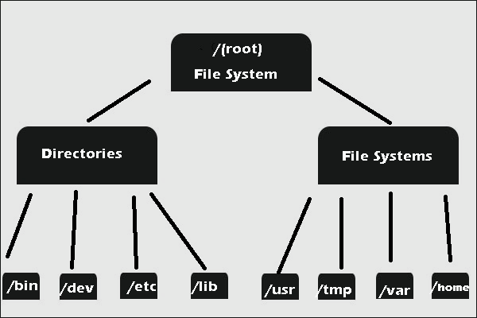

## Unix Command Line

- __Shell__ adalah sebuah program yang fungsinya untuk menghubungkan pengguna dengan sistem operasi, atau sederhananya shell adalah suatu program yang digunakan untuk berkomunikasi atau memerintah sistem. Nah setiap perintah yang di inputkan oleh user nantinya akan diterjemahkan oleh shell yang kemudian akan dikirimkan hasilnya ke kernel, setelah itu barulah kernel akan melakukan operasi yang diminta oleh user.

- __Command Line Interfaces (CLI)__ adalah sebuah program dimana user bisa mengetikkan perintah dalam bentuk teks dan memberikan instruksi pada komputer untuk mengerjakan tugas atau perintah tertentu. CLI sendiri merupakan jenis shell yang berbasis teks.

- __Terminal__ merupakan suatu tempat atau aplikasi dimana user akan mengetikan perintah berbasis text, atau sederhananya terminal adalah suatu aplikasi untuk mengakses Command Line Interfaces (CLI).

- __File System Structure__ merupakan sebuah file system yang fungsi nya adalah untuk mengatur bagaimana data disimpan di dalam sebuah system. Pada sistem operasi windows sendiri file sistem dan direktori akan disusun dengan menggunakan struktur yang bentuknya mirip seperti pohon. Nah untuk bentuk dari strukturnya sendiri dapat dilihat seperti pada gambar di bawah ini. <br>  

<br> <br>

- **Command Pada Unix Command Line** 
    - **pwd (print working directory)** berfungsi untuk melihat current working directory
    - **cp (copy)** berfungsi untuk menyalin file directory
    - **mv (move)** berfungsi untuk memindahkan file directory
    - **rm (remove)** berfungsi untuk menghapus file directory
    - **touch berfungsi** untuk membuat file directory
    - **ls (list)** berfungsi untuk melihat isi file di dalam directory
    - **cd (change directory)** berfungsi untuk berpindah directory
    - **mkdir** berfungsi untuk membuat sebuah directory
    - **head** berfungsi untuk melihat beberapa line awal dari sebuah file text
    - **tail** berfungsi untuk melihat beberapa line awal dari sebuah file text
    - **cat** berfungsi untuk melihat isi sebuah file

### Contoh Penggunaan Command
Berikut merupakan beberapa contoh penggunaan command :

- **cd (change directory)** 

```
$ cd .. 
```

- **ls (list)** 

```
$ ls 
```

- **pwd (print working directory)** 

```
$ pwd
```