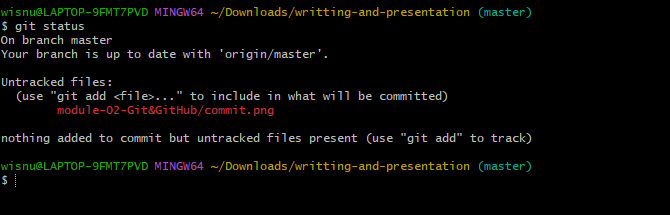
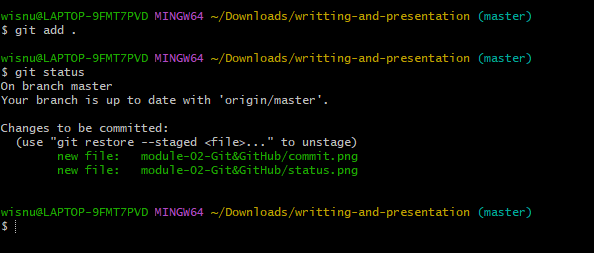
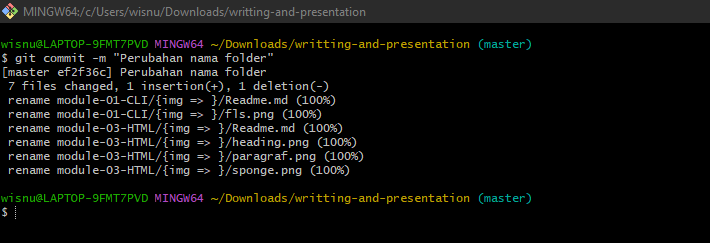
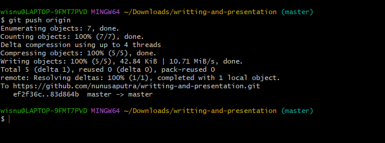

# Git & GitHub Dasar

- **Pengertian Git**
    - **Git** merupakan sebuah aplikasi yang dapat melacak setiap perubahan yang terjadi pada suatu folder atau file atau secara garis besar git ini merupakan sebuah version control system yang berfungsi untuk mencatat setap perubahan pada file dalam suatu projek yang dikerjakan baik secara individu maupun tim. Nah git sendiri biasa digunakan oleh programmer sebagai tempat untuk menyimpan file pemrograman mereka karena dinilai lebih efektif.

<br>

- **Pengertian GitHub**
    - **GitHub** merupakan sebuah platform atau layanan web host untuk proyek pengembangan perangkat lunak yang menggunakan sistem kendali Git dan layanan hosting internet. Secara sederhana GitHub ini merupakan sebuah platform berbasis website yang menyediakan layanan penyimpanan repository gratis dan dilengkapi oleh version control system.

<br>

- **Alasan Git & GitHub Wajib Digunakan Oleh Programmer**
    - Dengan menggunakn Git dan Github dapat membuat kerja kita lebih efektif karena kita bisa bekerja dalam sebuah tim. Tujuannya sendiri adalah kita dapat berkolaborasi dengan mengerjakan proyek yang sama tanpa harus repot melakukan copy paste folder aplikasi yang terupdate. Selain itu kita juga tidak perlu menunggu teman satu tim kita untuk menyelesaikan tugas atau projeknya, karena kita dapat membuat file di dalam projek yang sama lalu menyatukannya ketika sudah selesai.

    <br>

- **Command Pada Git**
    - Membuat Repository <br> 
    Repository adalah direktori proyek yang kita buat. 1 Repo =  1 Proyek = 1 Direktori

    
    <br>

    ```
        git init proyek-01
    ```

    Command line di atas akan membuat sebuah direktori baru.

    - Mengetahui status dari sebuah repository lokal <br>
    Git Status berfungsi untuk untuk mengetahui status dari sebuah repository lokal.

    <br>

    ```
    git status
    ```
    

    - Menambahkan file baru pada repository yang dipilih <br>
    Git add sendiri berfungsi untuk menambahkan file baru pada repository yang dipilih.

    <br>

    ```
        git add .
    ```
    

    - Melakukan Commit <br>
    Git Commit berfungsi untuk melakukan commit atau menyimpan perubahan pada version control pada git. Dan kita bisa menambahkan pesan untuk membeikan checkout pada setiap perbuahan. contohnya "git commit -m "Perubahan data"

    <br>

    ```
        git commit -m "Perubahan data"
    ```
    

    - Mempublish file ke github <br>
    Git Push origin berfungsi untuk mempublish file atau aplikasi ke github.

    <br>

    ```
        git push origin
    ```
    


