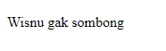

# HTML
- **Apa itu HTML?**
    - **HTML** atau Hypertext Markup Language merupakan sebuah bahasa markup yang digunakan untuk menampilkan konten pada browser. Contoh konten yang dapat ditampilkan oleh html seperti text, image, video, link, dan lain sebagainya. Nah HTML ini dapat kita analogikan seperti Microsoft Word, dimana html ini bersifat statis yang hanya bertugas untuk menampilkan konten yang diminta oleh developer. Perlu menjadi catatan bahwa html ini bukanlah sebuah bahasa pemrograman, artinya HTML tidak bisa dinamis dalam mengolah data.

<br>

- **Tools yang dibutuhkan dalam membuat HTML**
    - Ada beberapa tools yang dibutuhkan oleh seorang programmer dalam membangun sebuah website menggunakan html diantaranya seperti code editor dan juga web browser. Kita dapat menggunakan beberapa code editor yang cukup dikenal seperti Visual Studio Code, Sublime Text, Notepad++, dan lain sebagainya. Selain itu kita juga dapat menggunakan beberapa web browser yang cukup dikenal seperti Google Chrome, Mozila Firefox, Microsoft Edge, dan lain sebagainya.

<br>

- **Kerangka HTML**
    - HTML dibangun dengan sebuah kerangka dasar seperti head, title, dan juga body. Berikut ini merupakan contoh sederhana dari kerangka dasar HTML. <br> <br>

    ```html
        <html>
            <head>
                <title>Wisnu Imut</title>
            </head>
            <body>
                <h1>Ini Bapa Wisnu</h1>
            </body>
        </html> 
    ```

- **Tag HTML** <br>
    HTML terdiri dari beberapa elemen yang tersusun di dalam dokumen HTML. Secara anatomi, setiap elemen terdiri dari opening tag, content, dan closing tag. Di dalam opening tag terdapat atribut yang dapat diisi dengan nilai yang berbeda-beda.

    - **Opening Tag** <br>
    Opening tag adalah penanda pembuka dari sebuah elemen HTML. Setelahnya akan dianggap sebagai content. Penulisan opening tag menggunakan simbol < kemudian ditambah dengan tag name dan di akhiri dengan simbol >. <br> <br>

    ```html
        <h1>
        <p></p>
        </h1>
    ```

    - **Closing Tag** <br>
    Closing tag adalah penanda pengakhir dari sebuah elemen HTML. Setelahnya akan terdapat tag name yang sama dengan opening tag, yang membedakan adalah ditambah dengan simbol /. <br> <br>

    ```html
        </h1>
        </p>
    ```

    - **Content** <br>
    Content adalah bagian dari elemen HTML yang berisi beberapa karakter atau elemen lain. <br> <br>

    ```html
        <p>Wisnu anak baik</p>
    ```
<br>

- **Beberapa Contoh Tag Dalam HTML**

    - Tag untuk membuat paragraf <br><br>
    ```html
        <p>Wisnu gak sombong</p>
    ```
     

    - Tag untuk membuat heading <br> <br>
    ```html
        <h1>Wisnu jadi orang kaya, aamiin</h1>
    ```
    

    - Tag untuk menampilkan gambar <br> <br>
    ```html
        
    ```
    

<br>

- **Tag Semantic HTML**
Berikut ini adalah daftar semantic element yang sering digunakan:

    - ```<article>``` : untuk membuat elemen artikel.
    - ```<aside>``` : untuk membuat elemen bagian samping.
    - ```<details>``` : untuk membuat elemen detail atau spoiler.
    - ```<figcaption>``` : untuk membuat teks caption pada figure.
    - ```<figure>``` : untuk membuat figure atau gambar pada artikel.
    - ```<footer>``` : untuk membuat elemen bagian kaki dari web.
    - `<header>` : untuk mebuat kepala kop dari web.
    - `<main>` : untuk membuat elemen utama.
    - `<mark>` : untuk menandai teks.
    - `<nav>` : untuk membuat navigasi.
    - `<section>` : untuk membuat bagian artikel.
    - `<summary>` : untuk membuat ringkasan artikel atau isi spoiler.
    - `<time>` : untuk membuat elemen yang menyatakan waktu.

<br>

- **Deployment** <br>
Deploy adalah sebuah proses untuk menyebarkan aplikasi yang sudah kita kerjakan supaya bisa digunakan oleh orang-orang. Jika aplikasi kita HTML atau Web App kita perlu mendeploy ke server. Untuk melakukan hal tersebut kita bisa menggunakan layanan yang bernama Netlify