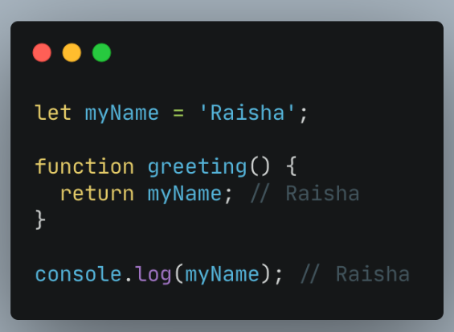
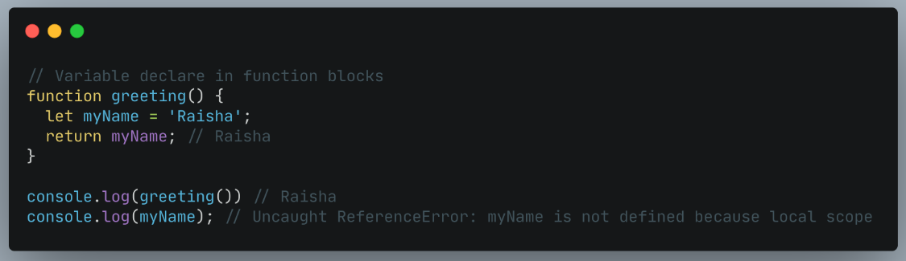
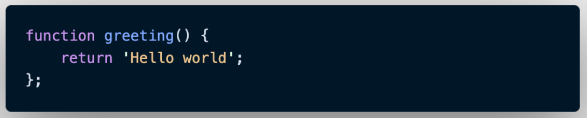
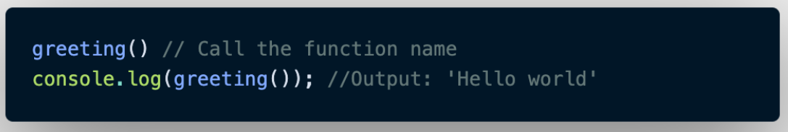
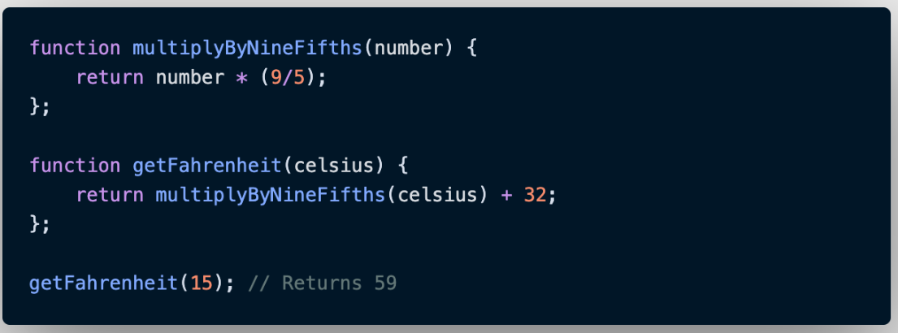
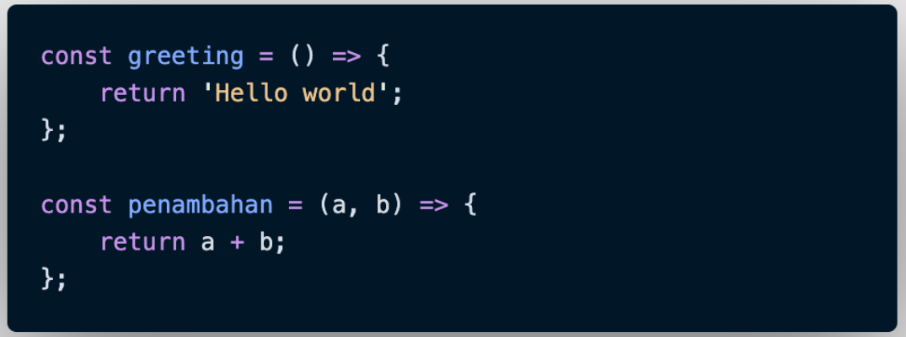
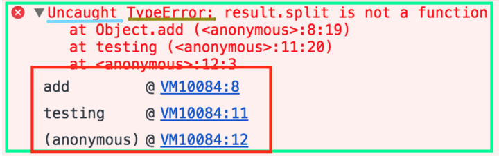
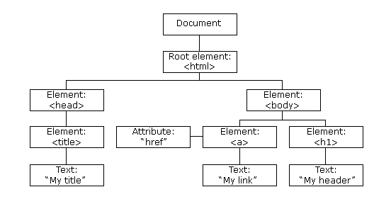

# Week 2

# Javascript Dasar - Part 2
**Senin, 26 September 2022**

## Scope
- **Apa itu scope** <br>
**Scope** itu merupakan konsep dalam flow data variabel. Dalam menentukan suatu variabel dapat diakses pada scope tertentu atau tidak.Secara sederhana analoginya seperti ini Kita semua bisa melihat bintang-bintang dilangit karena bumi bersifat global. Namun jika kamu tinggal di Bandung, kamu tidak akan bisa melihat monas yang berada di jakarta. Monas bersifat local yaitu hanya berada di Jakarta.

- **Apa itu blocks** <br>
**Blocks** itu merupakan code yang berasda didalam curly braces (atau kurung kurawal) {}. Beberapa contoh penggunaan blocks seperti conditional, function, dan looping.

- **Global Scope** <br>
**Global scope** itu berarti variabel yang kita buat dapat diakses dimanapun dalam suatu file. Agar menjadi Global Scope, suatu variabel harus dideklarasikan diluar Blocks. <br><br>


- **Local Scope** <br>
**Local scope** itu berarti kita mendeklarasikan variabel didalam blocks seperti function, conditional, dan looping. Maka variabel hanya bisa diakses didalam blocks saja. Tidak bisa diakses diluar blocks. <br> <br>


<br>

## Function

- **Apa itu function** <br>
**Function** itu merupakan sebuah blok kode dalam sebuah grup untuk menyelesaikan 1 task atau 1 fitur. Nah saat kita membutuhkan sebuah fitur tersebut nantinya, kita bisa kembali menggunakannya.

    **Berikut ini merupakan cara membuat dan memanggil function :**

    - Cara membuat function <br> <br>

    

    Function digunakan untuk melakukan serangkaian komputasi atau prosedur yang dapat digunakan berulang kali. Contohnya seperti function di atas, dimana function tersebut akan menampilkan kalimat Hello World. Penjelasan mengenai struktur di atas adalah function merupakan function keyword, kemudian kata greeting merupakan identifier, dan bagian di dalam kurung kurawal adalah key yang merupakan function body.

    - **Memanggil Function** <br> <br>
     <br> <br>

    Cara memanggil function sendiri cukup mudah, kita hanya perlu menuliskan nama variabel pada console.log seperti contoh gambar di atas ini.

<br>

## Parameter dan Argument

- **Parameter** <br>
**Parameter** merupakan elemen yang digunakan untuk mengasosiasikan variabel atau menyatukan setidaknya dua variabel kondisi atau “koneksi” antara dua variabel. Dengan parameter, function dapat menerima sebuah inputan data dan menggunakannya untuk melakukan task/tugas. Saat membuat function/fitur, kita harus tahu data-data yang dibutuhkan. Misalnya saat membuat function penambahan 2 buah nilai. Data yang dibutuhkan adalah 2 buah nilai tersebut.

    Contoh Parameter :

    ```javascript
        function tambah(a, b) {
            return a + b;
        }
    ```

- **Argument** <br>
**Argument** Merupakan nilai yang dikirimkan ke parameter saat function dipanggil, inputan yang akan dimasukkan dalam fungsi. Dan dari contoh code pseudocode sebelumnya yang disebut dengan argument ialah (3, 5) dimana nilai tersebut sebagai inputan dalam fungsi penjumlahan. Sederhananya argumen adalah nilai yang digunakan saat memanggil function dimana jumlah argumen nya harus sama dengan jumlah parameternya, jadi jika function tambah terdapat 2 parameter nilai saat membuat function, maka saat memanggil function kita gunakan 2 buah nilai argumen.

    Contoh penggunaan argument :

    ```javascript
        function tambah(a, b) {
            return a + b;
        }

        console.log(tambah(5, 5));
    ```

- **Alasan function sangat penting** <br>
Nantinya pada saat kita mengembangkan aplikasi dengan skala besar, function sangat sangat dibutuhkan agar kita dapat dengan mudah memanage code dan tracing code jika ada error.

- **Default Parameters** <br>
**Default paramaters** digunakan untuk memberikan nilai awal/default pada parameter function. Default parameters bisa digunakan jika kita ingin menjaga function agar tidak error saat dipanggil tanpa argumen

    Contoh penggunaan default parameter :

```javascript
    function nama(nama = "world") {
        return 'Helo' + nama;
    }

    console.log(nama("Wisnu)); // output : 'Helo Wisnu'
    console.log(nama()); // output : 'Helo world'
```

- **Function Helper** <br>
Dengan menggunakan function helper Kita bisa menggunakan function yang sudah dibuat pada function lain. <br> <br>


- **Arrow Function** <br>
**Arrow function** adalah cara lain menuliskan function. Ini adalah fitur terbaru yang ada pada ES6 (Javascript Version). <br> <br>


<br>

## **Errors and Debugging** <br> 
## Errors <br> <br>


Gambar diatas ini adalah contoh error, hijau adalah pesan kesalahan secara keseluruhan, biru muda untuk mencatat apakah kesalahan ditangani dengan benar, kecoklatan (kuning tua) adalah jenis kesalahan dan merah adalah tumpukan panggilan. 

Error dilempar ketika kesalahan runtime terjadi. Objek Error juga dapat digunakan sebagai objek dasar untuk pengecualian yang ditentukan pengguna. Error pada runtime akan menghasilkan objek error baru yang dibuat dan dilempar. Error adalah objek serial, sehingga dapat dikloning dengan StructureClone() atau disalin menggunakan postMessage().

Berikut ini merupakan beberapa type pada error :

- **EvalError** <br>
Membuat instance yang mewakili kesalahan yang terjadi terkait fungsi global eval().

- **RangeError** <br>
Membuat instance yang mewakili kesalahan yang terjadi saat variabel numerik atau parameter berada di luar rentang validnya.

- **ReferenceError** <br>
Membuat instance yang mewakili kesalahan yang terjadi saat mereferensikan referensi yang tidak valid.

- **Kesalahan sintaks** <br>
Membuat instance yang mewakili kesalahan sintaks.

- **TypeError** <br>
Membuat instance yang mewakili kesalahan sintaks.

- **URIError** <br>
Membuat instance yang mewakili kesalahan yang terjadi saat variabel atau parameter bukan tipe yang valid.

- **kesalahan URI** <br>
Membuat instance yang mewakili kesalahan yang terjadi saat encodeURI() atau decodeURI() melewati parameter yang tidak valid.

- **AggregateError** <br>
Membuat instance yang mewakili beberapa kesalahan yang dibungkus dalam satu kesalahan ketika beberapa kesalahan perlu dilaporkan oleh suatu operasi, misalnya oleh Promise.any().

- **InternalError Non-standard** <br>
Membuat instance yang mewakili kesalahan yang terjadi saat kesalahan internal di mesin JavaScript dilemparkan. Misalnya. "terlalu banyak rekursi".

<br>

## **Debugging** <br>
**Debugging** adalah sebuah proses mengidentifikasi dan menghapus bug atau error di dalam kode. Bug ini penyebab sebuah aplikasi atau software tidak dapat berjalan dengan baik. Seperti gagal login, error, tidak dapat menginput data, disfungsi fitur, blue screen, dan masalah lainnya. Pada dasarnya, sistem perkodean dalam sebuah program biasanya akan rumit dan juga kompleks. Maka salah satu terjadi kesalahan. Akan mempengaruhi keseluruhan program. Jadi bisa dikatakan tidak heran juga kalo dalam debugging bisa memakan waktu lebih lama dibandingkan menulis kode itu sendiri. Oleh karena itu debugging ini merupakan sebuah proses penting sebelum perilisan aplikasi maupun sesudahnya.

- **Alasan debugging perlu untuk dilakukan :** <br>
Proses debug adalah salah satu hal yang waib saat membangun sebuah aplikasi / software berbasis kode Selain tujuan adalah menyelesaikan bug, tapi proses ini memiliki segudan manfaat lainnya. Beberapa diantaranya;

    - Error dapat terdeteksi lebih dahulu
    - Proses perbaikan dapat dilakukan sedini mungkin
    - Menghindari kesalahan desain program lanjutan
    - Dapat memberikan informasi struktur data
    - Membantu developer mengurangi informasi yang tidak berguna
    - Mengurangi resiko hacker yang menyusup melalui celah bug juga error
    - Developer mungkin dapat menghindari proses testing yang rumit hingga dapat menghemat waktu dan energi saat proses coding. 

<br>

- **Langkah-langkah melakukan debugging**<br>
Dalam mengetahui lebih dalam proses debugging ini. Ada beberapa tahap atau langkah yang perlu kita lakukan. Secara garis besar, berikut langkah – langkah yang harus kita lakukan untuk melakukan debugging.

    - Mengidentifikasi error <br>
    Programmer akan mengidentifikasi kesalahan yang ada pada sistem yang kita kembangkan. Programmer harus bisa menemukan actual error agar perbaikan dapat kita lakukan dengan tetap sasaran.

    - Menemukan lokasi error <br>
    Setelah mengidentifikasi kesalahan dengan benar, maka tahap selanjutnya adalah memeriksa kode untuk menemukan lokasi dimana error tersebut muncul atau berada.

    - Menganalisis error <br>
    Pada tahap ini, programmer akan menganalisis kode yang menimbulkan error. Tahap ini kita lakukan untuk mengetahui apakah error yang ada dapat menimbulkan kesalahan pada tempat yang lain, serta memastikan apakah ada resiko kerusakan yang muncul saat kita lakukan perbaikan. Bug yang ada pada sistem tidak hanya merusak fungsionalitas yang ada. Namun juga dapat menyebabkan kesalahan pada area yang lain. Oleh karena itu, efek tersebut juga perlu kita analisis untuk mengantisipasi peningkatan jumlah bug dalam sistem yang sedang kita kembangkan.

    - Membuktikan hasil analisis <br>
    Setelah menganalisis actual error, programmer perlu menemukan kemungkinan error yang muncul dalam aplikasi. Pada tahap ini, programmer akan melakukan automated testing.

    - Melakukan perbaikan <br>
    Tahap terakhir adalah memperbaiki semua error dan memeriksa apakah semuanya berjalan dengan baik.

    Pada intinya, debugging berkaitan dengan langkah – langkah mengidentifikasi, menganalisis, dan menghapus kesalahan dan error. Proses ini akan mulai kitajalankan setelah perangkat lunak gagal dijalankan dengan baik dan diakhiri dengan memecahkan permasalahan dan berhasil menguji perangkat lunak.

<br> <br>

**Selasa, 27 September 2022**
# Data Type Buillt-in : Prototype and Method
## JavaScript data types and data structures
Semua bahasa pemrograman memiliki struktur data bawaan, tetapi ini sering berbeda dari satu bahasa ke bahasa lainnya. JavaScript adalah bahasa dinamis dengan tipe dinamis. Variabel dalam JavaScript tidak secara langsung terkait dengan jenis nilai tertentu, dan variabel apa pun dapat diberi (dan ditetapkan ulang) nilai dari semua jenis. Contohnya adalah seperti di bawah ini :

```javascript
    let foo = 42; // foo sekarang adalah sebuah number
    foo = "bar"; // foo sekarang adalah sebuah string
    foo = true; // foo sekarang adalah sebuah boolean
```

## Jenis-Jenis Javascript
Javacript sendiri terdiri dari primitive values dan object. Berikut ini merupakan beberapa jenis dari primitive values dan juga object pada javascript.

- **Primitive values** <br>
Semua jenis kecuali objek mendefinisikan nilai yang tidak dapat diubah (yaitu, nilai yang tidak dapat diubah). Misalnya, String tidak dapat diubah. Maka kita menyebutnya sebagai "nilai primitif" atau "primitive values.

- **Boolean Types** <br>
Boolean mewakili entitas logis dan dapat memiliki dua nilai yaitu benar dan salah. 

- **Nol Types**
Tipe Null memiliki tepat satu nilai yaitu null. 

- **Undifined Types** <br>
Variabel yang belum diberi nilai memiliki nilai yang tidak ditentukan. 

- **Numerik Types** <br>
ECMAScript memiliki dua tipe numerik bawaan: Number dan BigInt — bersama dengan nilai terkait NaN.

- **Nomor Types** <br>
Jenis Angka adalah nilai IEEE 754 format biner 64-bit presisi ganda. Ia mampu menyimpan angka floating-point positif antara 2^-1074 (Number.MIN_VALUE) dan 2^1024 (Number.MAX_VALUE) serta angka floating-point negatif antara -(2^-1074) dan -(2^ 1024), tetapi hanya dapat menyimpan bilangan bulat dengan aman dalam rentang -(2^53 1) (Number.MIN_SAFE_INTEGER) hingga 2^53 1 (Number.MAX_SAFE_INTEGER).

- **BigInt Types** <br>
Tipe BigInt adalah primitif numerik dalam JavaScript yang dapat mewakili bilangan bulat dengan presisi arbitrer. Dengan BigInt, kita dapat dengan aman menyimpan dan mengoperasikan bilangan bulat besar bahkan di luar batas bilangan bulat aman untuk Numbers.

- **NaN** <br>
NaN ("Not a Number") biasanya ditemui ketika hasil operasi aritmatika tidak dapat dinyatakan sebagai angka. Ini juga satu-satunya nilai dalam JavaScript yang tidak sama dengan dirinya sendiri.

- **String Types** <br>
Jenis String JavaScript digunakan untuk mewakili data tekstual. Ini adalah satu set "elemen" dari nilai integer 16-bit unsigned. Setiap elemen dalam String menempati posisi dalam String. Elemen pertama berada pada indeks 0, berikutnya pada indeks 1, dan seterusnya. Panjang dari sebuah String adalah jumlah elemen di dalamnya.

<br>

**28 - 30 September 2022**
## Javascript - DOM
DOM merupakan singkatan dari Document Object Model. Artinya, dokumen (HTML) yang dimodelkan dalam sebuah objek. Objek dari dokumen ini menyediakan sekumpulan fungsi dan atribut/data yang bisa kita manfaatkan dalam membuat program Javascript. Inilah yang disebut API (Application Programming Interface). DOM tidak hanya untuk dokumen HTML saja. DOM juga bisa digunakan untuk dokumen XML dan SVG. DOM juga tidak hanya ada di Javascript saja, DOM juga ada pada bahasa pemrograman lain.

- **Mengakses Elemen Tertentu Dengan DOM** <br>
Objek document adalah model dari dokumen HTML. Objek ini berisi kumpulan fungsi dan atribut berupa objek dari elemen HTML yang bisa digambarkan dalam bentuk pohon seperti ini : <br> <br>


Struktur pohon ini akan memudahkan kita dalam menggunakan elemen tertentu.

Apabila kita ingin mengakses elemen yang spesifik, terdapat beberapa fungsi yang bisa digunakan :

- getElementById() fungsi untuk memilih elemen berdasarkan atribut id.
- getElementByName() fungsi untuk memilih elemen berdasarkan atribut name.
- getElementByClassName() fungsi untuk memilih elemen berdasarkan atribut class.
- getElementByTagName() fungsi untuk memilih elemen berdasarkan nama tag.
- getElementByTagNameNS() fungsi untuk memilih elemen berdasarkan nama tag.
- querySelector() fungsi untuk memilih elemen berdasarkan query.
- querySelectorAll() fungsi untuk memilih elemen berdasarkan query.
dan lain-lain. <br> <br>

Di HTML DOM, semua element HTML dari sebuah website dianggap sebagai objek. Dan sama seperti objek JavaScript pada umumnya, objek element HTML di HTML DOM juga mempunyai properti dan method atau yang lebih dikenal dengan istilah DOM Property dan DOM Method. Jadi untuk mengubah nilai properti dari element HTML, kita bisa menggunakan DOM Property dan untuk memanggil fungsi dari suatu element HTML, kita bisa menggunakan DOM Method.

Contoh :

```javascript
    <input id="nama" type="text" value="wisnu" />
```

Untuk mengakses value dari `<input>` di atas, maka bisa dilakukan dengan cara sebagai berikut :

```javascript
    let nama = document.getElementById("nama").value;

    console.log(nama); // Output: "wisnu"
```

Penjelasan :
- document adalah akar dari semua objek di sebuah website. Jadi untuk mengakses element HTML apapun di satu website, selalu dimulai dengan objek document ini.
- getElementById merupakan method dari objek document.
- value merupakan properti dari objek element HTML yang dikembalikan dari method getElementById yaitu `<input>`.

## Mengakses Element HTML

- **getElementById(id)** <br>
Method yang ini sudah kita lihat beberapa kali dari contoh-contoh sebelumnya. Kita bisa menggunakan getElementById untuk mengakses element HTML berdasarkan nilai id-nya.

- **getElementsByTagName(tag)** <br>
Untuk mengakses element-element HTML berdasarkan jenis tag-nya, kita bisa menggunakan getElementsByTagName.

Contoh :

```javascript
    <h1 id="title">Helo Helo</h1>
    <p>Wisnu datang</p>
    <h1 class="subtitle">Mari kita jalan jalan</h1>
    let semuaTagH1 = document.getElementsByTagName("h1");

    console.log(semuaTagH1); // Output: HTMLCollection(2) [h1#title, h1.subtitle]
    console.log(semuaTagH1[0]); // Output: <h1 id="title">Helo Helo</h1>
    console.log(semuaTagH1[1]); // Output: <h1 class="subtitle">Mari kita jalan-jalan</h1>
```

Penjelasan :
- Ketika kita memanggil document.getElementsByTagName("h1"), document sebagai akar objek dari halaman html kita akan mencari semua element `<h1>` di bawahnya.
- Karena di contoh di atas terdapat 2 `<h1>`, maka document.getElementsByTagName("h1") akan mengembalikan 2 element `<h1>`. Untuk mengakses masing-masing element, bisa menggunakan [noIndex], sama seperti cara Array mengakses elementnya.

- **getElementsByClassName(className)** <br>
Untuk mengakses element-element HTML berdasarkan nilai attribute class-nya, kita bisa menggunakan getElementsByClassName.

Contoh :

```javascript
    <h1 class="header">Helo Helo</h1>
    <p>Wisnu datang</p>
    <span class="header">Mari kita jalan jalan</span>
    let semuaClassHeader = document.getElementsByClassName("header");

    console.log(semuaClassHeader); // Output: HTMLCollection(2) [h1.header, span.header]
    console.log(semuaClassHeader[0]); // Output: <h1 class="header">Helo Helo</h1>
    console.log(semuaClassHeader[1]); // Output: <span class="header">Mari kita jalan jalan</span>
```

Penjelasan :
- Ketika kita memanggil document.getElementsByClassName("header"), document sebagai akar objek dari halaman html kita akan mencari semua element dengan attribute class bernilai header di bawahnya.
- Karena di contoh di atas terdapat 2 element yang mempunyai class dengan nilai header, maka document.getElementsByClassName("header") akan mengembalikan 2 element, yaitu element <h1 class="header> dan <span class="header">. Untuk mengakses masing-masing element, bisa menggunakan [noIndex], sama seperti cara Array mengakses elementnya.

- **querySelectorAll(cssSelector)** <br>
Untuk mengakses element-element HTML berdasarkan CSS Selector-nya HTML, kita bisa menggunakan querySelectorAll.

```javascript
    <h1 class="header">Helo  Helo</h1>
    <p id="header2">Wisnu datang</p>
    <span class="header">Mari kita jalan jalan</span>
    let h1ClassHeader = document.querySelectorAll('h1.header');

    console.log(h1ClassHeader); // Output: NodeList [h1.header]
    console.log(h1ClassHeader[0]); // Output: <h1 class="header">Helo Helo</h1>

    let idHeader2 = document.querySelectorAll('#header2');

    console.log(idHeader2); // Output: NodeList [p#header2]
    console.log(idHeader2[0]); // Output: <p id="header2">Wisnu datang</p>
```

Penjelasan : <br>
Ketika kita memanggil document.querySelectorAll("h1.header"), document sebagai akar objek dari halaman html kita akan mencari semua element `<h1>` dengan attribute class bernilai header di bawahnya. Begitu juga ketika memanggil document.querySelectorAll('#header2'), document akan mencari semua element dengan id bernilai header2 di bawahnya.

## Dom Event
Dom event sendiri berfungsi untuk membuat website kita menjadi lebih interaktif dan dinamis. Berikut merupakan contoh dari penggunaan dom events.

```javascript
    <button id="demo">Click Me!<button>

    let demo = document.getElementById("demo");
    demo.onclick = showMessage;

    function showMessage() {
    alert("Hello, World!");`
}
```

Penjelasan :
- Di baris demo.onclick = showMessage;, kita menambahkan event onclick ke element `<button id="demo">` dan memberi nilai showMessage yang merupakan fungsi untuk menampilkan alert dengan tulisan "Hello, World!".
- Jadi ketika `<button id="demo">` di-klik, maka alert window dengan tulisan "Hello, World!" akan muncul, sesuai dengan gambar di atas.

<br>

## Manipulating Element and Style
- element.innerHTML <br>
Kita bisa menggunakan DOM Property innerHTML untuk mengambil/mengubah isi HTML dari sebuah element.

    Contoh :

    ```javascript
        <!-- html -->
        <p id="demo">Hello, World!</p>
        // js
        let demo = document.getElementById("demo");

        console.log(demo.innerHTML); // Output: Hello, World!

        // Ubah konten <p id="demo"> menjadi Hello, Dunia!
        demo.innerHTML = "Hello, Dunia!";

        console.log(demo.innerHTML); // Output: Hello, Dunia!
    ```

    Penjelasan :
    - Di baris console.log(demo.innerHTML);, kita hanya menampilkan nilai properti innerHTML dari element `<p id="demo">`. Waktu kode itu dijalankan, isi konten HTML dari element `<p id="demo">` masih bernilai `Hello, World!`.
    - Kode berikutnya yaitu `demo.innerHTML = "Hello, Dunia!";` kita akan memberikan nilai baru ke properti `innerHTML-nya <p id="demo">`.
    - Apabila kita cek halaman website kita di browser, `<p id="demo">` yang tadinya menampilkan Hello, World! akan berubah menjadi Hello, Dunia! setelah kode JavaScript di atas dijalankan. <br> <br>

- **element.attribute** <br>
element.attribute merupakan DOM Property yang bisa digunakan untuk mengambil atau mengubah atau menambah nilai attribute dari sebuah element.

Contoh :

```js
    <!-- html -->
    
```
 <br> <br>

```js
    // js
    let catImage = document.getElementById("cat-image");

    console.log(catImage.src); // Output: https://bit.ly/2FKluzq
    console.log(catImage.alt); // Output: Cat

    catImage.src = "https://bit.ly/3j6YdWJ";
    catImage.alt = "Fish";
    catImage.width = "400";

    console.log(catImage.src); // Output: https://bit.ly/3j6YdWJ
    console.log(catImage.alt); // Output: Fish
    console.log(catImage.width); // Output: 400
```
 <br> <br>

Penjelasan :

- Di baris console.log(catImage.src);, kita hanya menampilkan nilai attribute src dari element ``. Waktu kode itu dijalankan, nilai attribute src dari element `` masih bernilai https://bit.ly/2FKluzq.
- Di baris console.log(catImage.alt);, kita hanya menampilkan nilai attribute alt dari element ``. Waktu kode itu dijalankan, nilai attribute alt dari element `` masih bernilai Cat.
- Kode berikutnya yaitu cat.src = "https://bit.ly/3j6YdWJ"; kita akan memberikan nilai baru ke attribute src-nya ``.
- Begitu juga di kode berikutnya yaitu cat.alt = "Fish"; kita akan memberikan nilai baru ke attribute alt-nya ``.
- Kode berikutnya yaitu catImage.width = "400"; kita akan menambah attribute width ke element `<h1 id="demo">` dengan nilai 400.
- Apabila kita cek halaman website kita di browser, `` yang tadinya menampilkan foto kucing akan berubah menjadi foto ikan setelah kode JavaScript di atas dijalankan.

<br>

- **element.setAttribute(attribute, nilai)** <br>
`setAttribute(attribute, nilai)` fungsinya hampir sama dengan element.attribute = nilai hanya saja setAttribute itu termasuk DOM Method sedangkan `element.attribute` itu DOM Property.

<br>

## DOM Forms
DOM Form dikaitkan dengan elemen `<form>` HTML HTML DOM form dapat  membuat dan mengakses elemen formulir menggunakan metode `createElement()` dan `getElementById()` dari objek dokumen dan juga mengatur berbagai properti dari objek form dan bisa mendapatkannya juga.

- **Properti**
- acceptCharset	<br>
Untuk mengatur atau mengembalikan nilai atribut accept-charset dalam formulir.
Action	Untuk mengatur atau mengembalikan nilai atribut tindakan dari formulir
- Autocomplete <br>Untuk menyetel atau mengembalikan nilai atribut pelengkapan otomatis formulir.
- Encoding	<br>
hanya sebuah alias dari enctype.
- Enctype <br>	
Untuk mengatur atau mengembalikan nilai atribut enctype dari form.
- Length	<br> 
Untuk mengembalikan berapa banyak elemen yang ada dalam form.
- Method	<br> 
Untuk mengatur atau mengembalikan nilai atribut metode dari form.
- Name	<br>
Untuk mengatur atau mengembalikan nilai atribut nama form.
- noValidate	<br>
Untuk mengatur atau mengembalikan apakah form-data harus divalidasi atau tidak, saat dikirimkan oleh pengguna.
- Target	<br>
Untuk mengatur atau mengembalikan nilai atribut target dari form.

### Metode
Berikut ini metode form dom
1.	Reset() : Untuk mengatur ulang form
2.	Submit() : Untuk mengirimkan formu


