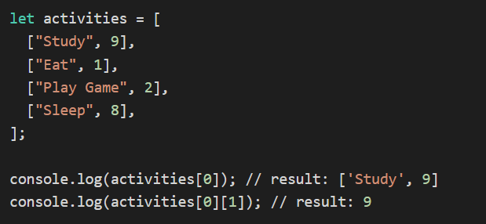
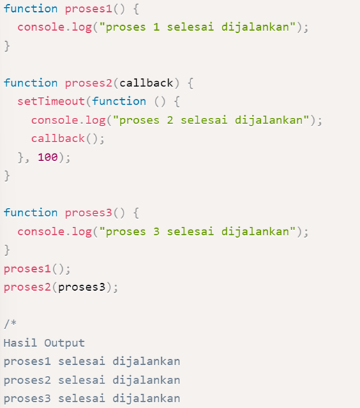
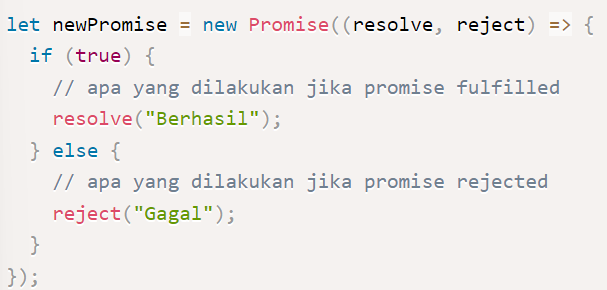

# Week 3
# **Javascript Intermediate**

## **Array**
- **Pengertian Array**  
**Array** adalah struktur data sederhana berisi deretan data (elemen) yang bisa diakses dengan menggunakan nomor indeks atau key. Indeks sebuah array dimulai dari nol. Array adalah tipe data list order yang dapat menyimpan tipe data apapun di dalamnya. Array dapat menyimpan tipe data String, Number, Boolean, dan lainnya.

- **Cara Mengakses Array**  
**Elemen** array diakses dengan menggunakan zero based index. Dengan kata lain, elemen array diberikan penomoran yang berurutan, dimulai dengan angka 0. Kita bisa mendapatkan elemen dengan menggunakan nomor tersebut dan ditaruh di dalam tanda kurung siku.

- **Property Array**  
Properties adalah fitur yang sudah disediakan oleh Javascript untuk memudahkan developer.
    - Consrtuctor : Mengembalikan fungsi yang membuat prototipe objek Array
    - Length : length akan mengembalikan nilai dari jumlah panjang data suatu array.
    - Index : Cari array untuk elemen dan kembalikan posisinya
    - Input :
    - Prototype : Memungkinkan  untuk menambahkan properti dan metode ke objek Array

- **Method Array**  
Array memiliki method atau biasa disebut built-in methods.

    Contoh built-in methods:
    1.	Push() : Saat kita menggunakan array, kita sering kali perlu menambahkan atau menghapus elemen. Dalam Javascript sendiri terdapat method push() dan pop() yang bisa digunakan.
    2.	Pop() : Method pop() merupakan kebalikan dari push(), ia menghapus elemen terakhir dari suatu array dan mengembalikan elemen yang dihapus. Method ini tidak menerima parameter apapun.
    3.	Shift() : shift() adalah method untuk menghapus item Array pada index pertama.

  

## Array Multi-Dimensional
**Array multi-dimensi** adalah bentuk perluasan dari array satu dimensi dan sering digunakan untuk menyimpan data mathematic computations, image processing, dan record management. Secara sederhana, bisa dikatakan bahwa Array multidimensi adalah array yang berisi array lainnya.

Bayangkan multidimensional ini seperti Table dan baris pada table itu menunjuka jumlah array.Column pada table itu menunjukan isi dari tiap array.
Untuk mendeklarasikan array multidimensi, kita bisa menggunakan sintaks yang sama dengan mendeklarasikan array satu dimensi:
let activities = [];

- **Akses index array multidimensional**
Untuk mengakses araay multidimensi, pertama-tama kita bisa menggunakan tanda kurung siku [] untuk mengakses elemen dari outer array (baris) dan kemudian tanda kurung siku selanjutnya untuk mengakses elemen dari inner array (kolom).    

 

## **Rekursif**
- **Pengertian Rekursif**  
**Rekursif** adalah suatu teknik pemrograman yang menggunakan function atau fungsi. Sederhananya adalah fungsi yang memanggil fungsi tersebut atau dirinya sendiri, seolah-olah terjadi suatu perulangan. Proses pemanggilan inilah yang disebut sebagai recursion (rekursi) dan akan terus dilakukan sampai pada kondisi yang sudah ditentukan.

    Dengan menggunakan rekursif, untuk dapat merancang suatu logika penyelesaian menjadi lebih baik dan mudah dibaca. Namun dari kelebihannya itu, rekursif menggunakan banyak memori sehingga membuat aplikasi menjadi lambat jika data yang diuji sangat banyak.

- **Ciri-Ciri Rekursif**  
    - Fungsi rekursif selalu memiliki kondisi yang menyatakan kapan fungsi tersebut berhenti. Kondisi ini harus dapat dibuktikan akan tercapai, karena jika tidak tercapai maka kita tidak dapat membuktikan bahwa fungsi akan berhenti, yang berarti algoritma kita tidak benar.
    - Fungsi rekursif selalu memanggil dirinya sendiri sambil mengurangi atau memecahkan data masukan setiap panggilannya. Hal ini penting diingat, karena tujuan utama dari rekursif ialah memecahkan masalah dengan mengurangi masalah tersebut menjadi masalah-masalah kecil.

- **Cara Membuat dan Memanggil Rekursif**  
Jika recursive function tersebut memanggil dirinya sendiri, akan terjadi infinity recursion (rekursi tak hingga). Maka dari itu ada beberapa hal yang harus diperhatikan dalam membuat recursive function.

    Algoritma rekursif mempunyai 2 komponen utama, yaitu:

    1. Base Case
    Kasus dasar untuk menyelesaikan permasalahan. Base case akan dikunjungi jika rekursi berakhir (kondisi untuk berhenti terpenuhi), serta mengembalikan nilai tanpa melakukan rekursi kembali.

    2. Recursion Call
    Permasalahan yang ada tentunya akan diperkecil dengan melakukan pemanggilan function itu sendiri (recursion call). Permasalahan dapat diperkecil dengan mengurangi atau memecahkan data input pada setiap pemanggilannya hingga mencapai base case.

   

## **Object**
**Tipe Object** mewakili salah satu tipe data JavaScript . Ini digunakan untuk menyimpan berbagai koleksi kunci dan entitas yang lebih kompleks. Objek dapat dibuat menggunakan Object()konstruktor atau penginisialisasi objek / sintaks literal. Hampir semua objek dalam JavaScript adalah instance dari Object; objek khas mewarisi properti (termasuk metode) dari Object.prototype, meskipun properti ini mungkin dibayangi (alias diganti). Namun, an Object mungkin sengaja dibuat yang tidak benar (misalnya dengan Object.create(null)), atau dapat diubah sehingga tidak lagi benar (misalnya dengan Object.setPrototypeOf).

Perilaku Object konstruktor tergantung pada tipe input.

- Jika nilainya null or undefined, itu akan membuat dan mengembalikan objek kosong.

- Jika nilainya sudah menjadi objek, itu akan mengembalikan nilainya.

- Jika tidak, itu akan mengembalikan objek Tipe yang sesuai dengan nilai yang diberikan.

Ketika dipanggil dalam konteks non-konstruktor, Object berperilaku identik dengan new Object().

  

## **Asyncronus**
- **Pengertian Asyncronus**
**Asynchronous** yang biasa dikenal juga dengan sebutan non-blocking mengizinkan komputer kita untuk memproses perintah lain sambil menunggu suatu proses lain yang sedang berlangsung. Eksekusi perintah dengan asynchronous tidak akan melakukan blocking atau menunggu perintah sebelumnya selesai. Jadi sambil menunggu kita bisa mengeksekusi perintah lain.

- **Cara menjalankan asyncronus pada javascript**

    Jika JavaScript secara default bersifat synchronous, Ada beberapa cara untuk membuat proses asynchronous, yaitu :

    1.	setTimeout(function, milliseconds) digunakan untuk simulasi pemanggilan kembali proses asynchronous yang sedang/sudah selesai dijalankan. Pemanggilan hanya dilakukan 1 kali.

    2.	setInterval(function, milliseconds) digunakan untuk simulasi pemanggilan proses asynchronous yang sedang/sudah dijalankan dalam interval waktu tertentu. Pemanggilan dilakukan berkali-kali sesuai interval waktu yang ditentukan.

    
- **Callback**  
**Callback** adalah sebuah function, namun bedanya dengan function pada umumnya adalah pada cara eksekusinya. Jika function pada umumnya dieksekusi secara langsung, sedangkan callback dieksekusi di dalam function lain melalui parameter.    

 

- **Promise**  
**Promise** sendiri adalah salah satu fitur dari ES6 (ES2015) JavaScript. Konsep promise hadir untuk memecahkan masalah yang bertele-tele dengan callback.

    3 status promise di javascript :

    1.	pending, jika data sedang diproses.

    2.	fulfilled, jika data telah berhasil didapatkan.

    3.	rejected, jika data gagal didapatkan.

    Contoh :    
    

